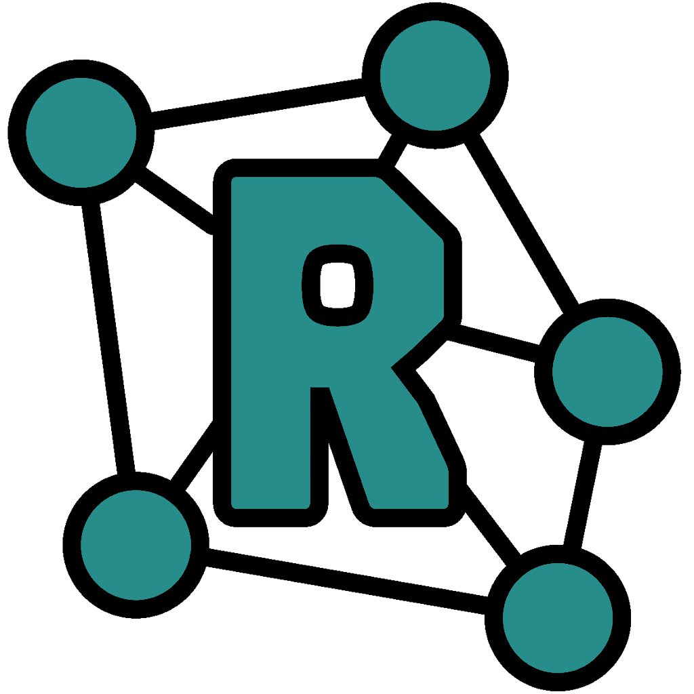

    
 <h1>Relaytable</h1>

## Overview
**Relaytable** is a easy to use NKN mining tool. It wil automatically install and update the latest mining node software, and provide the user with an easy setup configuration on first startup.

## Contributing

**Can I submit a bug, suggestion or feature request?**

Yes. Please [open an issue](https://github.com/MutsiMutsi/Relaytable/issues/new) for that.
